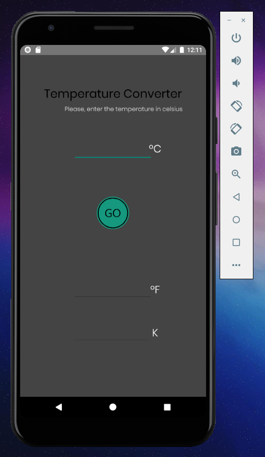

# 📚 School-management-app 📚
### Feito por Rodrigo Smith, em Java

Um aplicativo simples nativo Android, feito em Java. Seu objetivo é converter tempretauras de Celcius para Fahrenheit e Kelvin.

## 🎨 Interface 🎨
O aplicativo tem elementos simples, disponíveis pela própria linguagem Java, todos em um arquivo XML. Também foi adicionado um CircleButtun, disponível em *https://github.com/markushi/android-circlebutton*. Segue abaixo uma screenshot da interface:    

 
